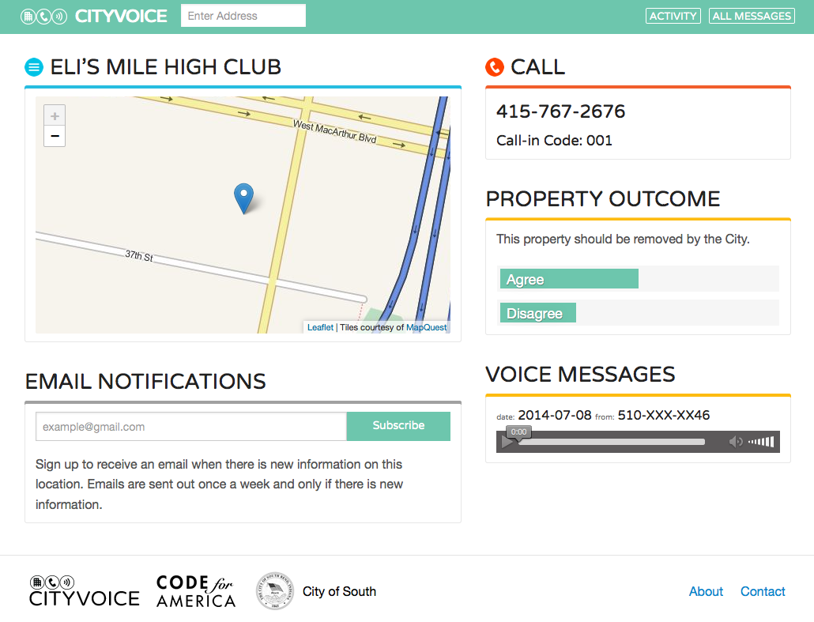
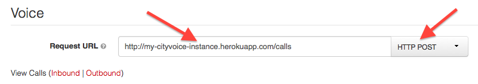

CityVoice  
=========
CityVoice is a place-based call-in system to collect community feedback on geographic entities (like vacant properties) using the simple, accessible medium of the telephone.

Using CityVoice in your city
---------------

CityVoice is an open source project, and we'd love for you to use it yourself!

To use CityVoice, there are three main steps:

- [Making a CityVoice survey](#making-a-cityvoice-survey)
- [Deploying the web application](#deploying-the-app)
- [Outreach and marketing to the community](#outreach-and-marketing)

Following this documentation, a semi-technical user — someone with experience using a terminal or command prompt — who has an idea of what kind of survey they would like to run should be able to get CityVoice up and running in a relatively short amount of time (less than a day).

Using the recommended deployment instructions below, the tech cost (hosting and other services) should run you about $50 per month.

If you have problems using CityVoice, please [open an issue here on GitHub](https://github.com/codeforamerica/cityvoice/issues/new) and let us know what problems or difficulties you encountered in as much detail as you can.

Making a CityVoice survey
-----

What you'll need to make a CityVoice survey:

1. A set of locations (for example, properties or neighborhoods) that callers will call in about or from
2. A set of 2-5 questions that you want to ask callers
  - Agree/disagree questions
  - A voice message question
3. A microphone (for example, using a laptop or phone) to record mp3 audio files

The exact steps for making and setting these up in CityVoice are in [the "Making a Survey" document](making_a_survey.md).

Deploying the app
----------

### Third-Party Services

Before deploying, here are the third-party services that are either required or easiest to use.

#### 1. (Required) [Twilio](https://twilio.com) — telephone API

First, you'll need a paid Twilio account and phone number:

- [Register an account](https://www.twilio.com/try-twilio) and add payment information
- [Buy a phone number](https://www.twilio.com/user/account/phone-numbers/available/local)

If you're new to Twilio, you'll have to add $10 in credit (the minimum) to your account to get started. This will be more than enough for CityVoice, which required $1/month for the phone number and 1 cent per call minute (~ $2/month in total).

#### 2. (Recommended) [Heroku](https://heroku.com) — application hosting

Heroku is an easy and cheap (~$50/month) way to host your CityVoice instance.

If you have experience with Ruby on Rails, you can alternately deploy to any infrastructure that supports a Rails 4 application and Postgres.

### Deploying on Heroku

To follow the below instructions, you will first need to [install the Heroku toolbelt](https://toolbelt.heroku.com/) on your computer.

Below are example instructions for deploying to Heroku. The process will be similar for other platforms (e.g., Amazon EC2, Red Hat OpenShift).

First, clone the application:

	$ git clone git@github.com:codeforamerica/cityvoice.git

Go into the repo folder:

    $ cd cityvoice

Create a Heroku app:

    $ heroku create
    
Set the secret token:

    $ heroku config:set SECRET_TOKEN=`python -c 'import uuid; print uuid.uuid4()'`

Take the CSV and mp3 files content you created in the "[Making a CityVoice survey](making_a_survey.md)" section, put them in their destination folders (`/data` and `/app/assets/audios/`) and add and commit them into the repo.

	$ git add data/ app/assets/audios/
	$ git commit -m "Add customized CSVs and audio files for my deployment"

Next, push the code to Heroku:

    $ git push heroku master

Migrate the database:

    $ heroku run rake db:migrate

Load the locations and questions:

    $ heroku run rake import:locations
    $ heroku run rake import:questions

Add an additional web dyno so that the app never sleeps (this is necessary so the app always answers when people call in):

	$ heroku ps:scale web=2

#### Configuring Twilio

To configure your number on Twilio's site, log in and go to [your "Numbers" page](https://www.twilio.com/user/account/phone-numbers/incoming). Then click on the phone number you bought.

In the 'Voice' area, put your deployed application's URL followed by `/calls` in the 'Request URL' field and select `HTTP POST` from the dropdown.

For example, for an app at http://my-cityvoice-instance.herokuapp.com:

#### Optional features

CityVoice also has a number of optional features you can set up:

- [Email notifications](optional_features.md#email-notifications)
- [Custom map tiles](optional_features.md#custom-map-tiles)
- [Google Analytics](optional_features.md#google-analytics)
- [Password protection](optional_features.md#password-protection)

Outreach and Marketing
-----

Effective outreach might be the most important piece to making your use of CityVoice a success. Here are some tips from past CityVoice uses that might be helpful:

- Physical, prominent, and persistent calls to action are very useful. For example, a large sign in a park that's there for two months is much better than a poster on a bulletin board with 20 other posters or a mass email.

- Promotion, outreach, and media campaigns around the application are incredibly important. Without an effective campaign no one will know or care about the project.

- The application is really built to ask questions about locations. Although it can work in other situations, it works best when tied to specific places.

If you've used CityVoice before and have additional ideas, let us know! [Click here and describe your experience with doing CityVoice outreach](https://github.com/codeforamerica/cityvoice/issues/new).

For developers - local setup
-----------

If you're a software developer and would like to work on CityVoice, this section will get you up and running.

CityVoice is a Ruby on Rails 4 application and uses Postgres as its database (other databases may work, but are untested).

To get started with development, clone the repo and cd into the directory:

	$ git clone git@github.com:codeforamerica/cityvoice.git
	$ cd cityvoice

Use Bundler to install dependencies:

    $ bundle install

To get the application set up for local development, first copy database.yml:

    $ cp config/database.yml.example config/database.yml

Then, edit it for your local Postgres installation and run:

    $ rake db:reset db:test:prepare

Next, load some sample data:

    $ rake import:locations
    $ rake import:questions

Tests are written in RSpec, and can be run as normal:

	$ rake spec

### Twilio Local Setup

In order to set up Twilio for local development, you'll need a way to connect Twilio to your local machine.  The easiest way for this to happen is to install [ngrok](https://ngrok.com).

Then, run `ngrok 3000` to open a tunnel:

    $ ngrok 3000
    Tunnel Status                 online
    Version                       1.6/1.5
    Forwarding                    http://xxx.ngrok.com -> 127.0.0.1:3000
    Forwarding                    https://xxx.ngrok.com -> 127.0.0.1:3000
    Web Interface                 127.0.0.1:4040

Log into your Twilio application, open up your [phone number](https://www.twilio.com/user/account/phone-numbers/incoming) and change the Voice Request URL to the your ngrok address with `/calls` at the end. For example:

`https://xxx.ngrok.com/calls`

Also select `POST` from the dropdown next to the URL box.

Contributing
------------

1. Fork it
2. Create your feature branch (`git checkout -b my-new-feature`)
3. Commit your changes (`git commit -am 'Add some feature'`)
4. Push to the branch (`git push origin my-new-feature`)
5. Create new Pull Request

License and Copyright
---------------------

Copyright 2013-2014 Code for America, MIT License (see LICENSE.md for details)
