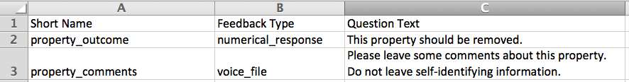
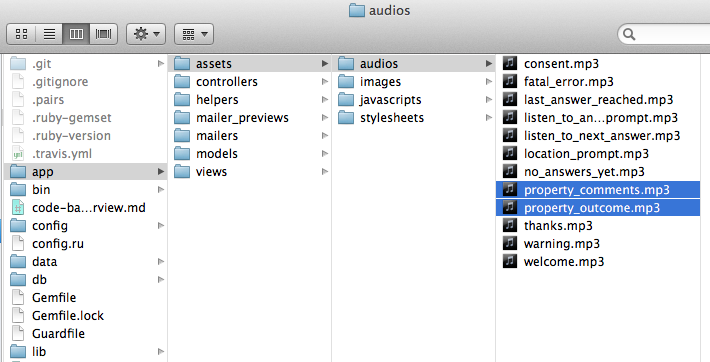
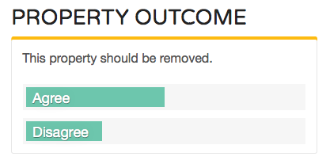
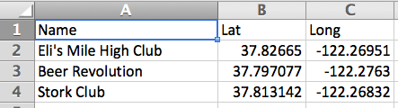

Making a CityVoice survey
===========

Making a survey for CityVoice involves three steps:

1. [Writing questions](#writing-questions)
2. [Adding locations](#adding-locations)
3. [Recording audio files](#recording-audio-files)

## Writing questions

The first step to using CityVoice is deciding what questions you want callers to answer.

There are two types of questions:

- **Agree/disagree questions** — a caller presses 1 or 2 to say whether they agree or disagree with a statement
- **Voice questions** — a caller leaves a voice message that can be listened to by other callers and visitors to the web site

### Configuring questions

You configure your questions by editing the [data/questions.csv](data/questions.csv) file. It's easily edited in Excel or a text editor.

Each question requires a bit of information:

1. **Short Name** — This is a shorthand description of the question, will show up on the web page above responses, and also the filename for the mp3 audio file you'll record.
2. **Feedback Type** — This should either be "numerical_response" for an agree/disagree question, or "voice_file" for a voice question.
3. **Question Text** — This is the text of the question. This shows up on the web page 

Questions will be asked in the order that they are in this file. We recommned you put your voice question last.

### Example

Let's walk through an example with questions someone might want to ask about abandoned properties. We'll have two questions:

- One "agree-disagree" question about whether the property should be removed, and
- One voice question for comments about the property

First, we would edit the CSV file to look like this:

Second, we would record audio files to play to the callers for these two questions, save those files as "short_name.mp3", and put them in the `app/assets/audios/` folder:

Now we're good to go! With our example, the "agree/disagree" question will show up on the CityVoice site like this:

## Adding locations

Next, you want to add locations for your CityVoice survey.

Locations can be either:

- Places you want to ask questions about (for example, an abandoned property)
- Places that you want to segment your feedback by (for example, different neighborhood)

You can add locations by editing the [data/locations.csv](data/locations.csv) file. (Similar to the `questions.csv` file, you can edit this in Excel or a text editor.) It looks like this:

You will need to provide:

1. **Name** — the name that will show up on the web site
2. **Lat and Long** — the latitude and longitude of the location

There are a number of tools for finding the latitude and longitude of your locations online.

- If you have **a small # of individual locations**, this site is good: http://itouchmap.com/latlong.html
- If you have **a large # of addresses**, you can use site that geocodes addresses, for example [CartoDB](http://www.cartodb.com/) or [BatchGeo](http://batchgeo.com/)

## Recording audio files

The main way people interact with CityVoice is by calling in to a phone number and responding to different voice prompts. So to use CityVoice, you will need to record some audio files for your survey (in an mp3 format).

Here are some easy-to-use programs for recording audio:

- On Mac, Quicktime
- On Windows, Sound Recorder
- On Linux, [Audacity](http://audacity.sourceforge.net/)

### Required — audio files you have to record yourself

#### 1. welcome.mp3

- This is the first message played when people call in.
- It should provide any context for the survey that callers will need, but wouldn't have already.
- Recommended length: 10-20 seconds

Example <a href="app/assets/audios/welcome.mp3?raw=true">(click here to listen)</a>

> Hi, thanks for calling about a vacant and abandoned property in South Bend. If you'd like to learn more about the vacant and abandoned property initiative, including how to acquire an abandoned house or vacant lot, please visit SouthBendVoices.com, or go to the County-City Building and pick up an informational pamphlet in the Mayor's Office or in Community Investment. If this is an urgent matter, please hang up and call 311.

#### 2. consent.mp3

- This file asks callers if they want to make their phone number available to you (the CityVoice survey organizer).
- Make sure you include "for yes, press 1. For no, press 2."

Example <a href="app/assets/audios/consent.mp3?raw=true">(click here to listen)</a>

> Do you want to make your phone number available to the City for follow-up? For yes, press 1. For no, press 2.

#### 3. thanks.mp3

- This is the last message played to callers.
- It should thank them for their feedback and give them any additional information that would be helpful — for example, how the feedback will be used, next steps, or how they can follow up.

Example <a href="app/assets/audios/thanks.mp3?raw=true">(click here to listen)</a>

> Thanks for your feedback. This information will help the City prioritize its actions around vacant and abandoned properties. If you have urgent feedback, or would like to speak with a city employee, please hang up and call 311. You can listen to messages from your neighbors and learn more about how to acquire a vacant and abandoned property at SouthBendVoices.com. Have a nice day!

#### 4. fatal_error.mp3

- This file is played when a caller has hit an unexpected button two times in a row.
- The friendliest experience is apologizing for the system having problems, and giving the caller another way to give their feedback (for example, calling 311).

Example <a href="app/assets/audios/fatal_error.mp3?raw=true">(click here to listen)</a>

> Sorry, we're still having problems understanding your input. If you want to talk to a City employee in person, please hang up and call 311. If you'd like to give feedback about this system, please email southbend@codeforamerica.org. Goodbye.

### Optional — audio files with general defaults you can optionally re-record/customize

We recommended you also record customized audio files with the content below: having the same voice throughout the call makes the phone survey experience a bit nicer for callers.

But because these files are somewhat general, you can always just use the defaults.

#### 5. location_prompt.mp3

- This is played immediately after the _welcome_ message.
- This asks the caller to enter the call-in code for the location they're calling from or about.

Default audio <a href="app/assets/audios/location_prompt.mp3?raw=true">(click here to listen)</a>

> Please enter a location code now.

#### 6. listen_to_answers_prompt.mp3

- This asks the caller if they would like to listen to other callers' feedback, or if they would like to simply go to leaving their own feedback.
- Button options: to listen to feedback, press 1; to share feedback, press 2.

Default audio <a href="app/assets/audios/listen_to_answers_prompt.mp3?raw=true">(click here to listen)</a>

> To listen to feedback from other residents, press 1. To share your own feedback, press 2.

#### 7. no_answers_yet.mp3

- This tells the caller that there is no feedback for the location they are calling in about yet.

Default audio <a href="app/assets/audios/no_answers_yet.mp3?raw=true">(click here to listen)</a>

> There isn't any feedback for this location yet. Please check back later.

#### 8. listen_to_next_answer.mp3

- When there are multiple messages, this asks the caller if they would like to listen to another message, or just move on to leaving their own feedback.
- Button options: listen to another message, press 1; leave your own feedback, press 2.

Default audio <a href="app/assets/audios/listen_to_next_answer.mp3?raw=true">(click here to listen)</a>

> To listen to another message, press 1; to leave your own feedback, press 2.

#### 9. last_answer_reached.mp3

- This is played when a caller is listening to others' feedback on the phone, but there are no other messages remaining.
- Button options: to leave your own feedback, press 1. Otherwise, please hang up.

Default audio <a href="app/assets/audios/last_answer_reached.mp3?raw=true">(click here to listen)</a>

> There's no more feedback for this location. to leave your own message, press 1. If you don't want to leave any feedback, please hang up now.

#### 10. warning.mp3

- This is played when a caller presses an unexpected button, followed by repeating whatever was playe before that the caller is pressing a button in response to.

Default audio <a href="app/assets/audios/warning.mp3?raw=true">(click here to listen)</a>

> Sorry, we didn't understand your input.

